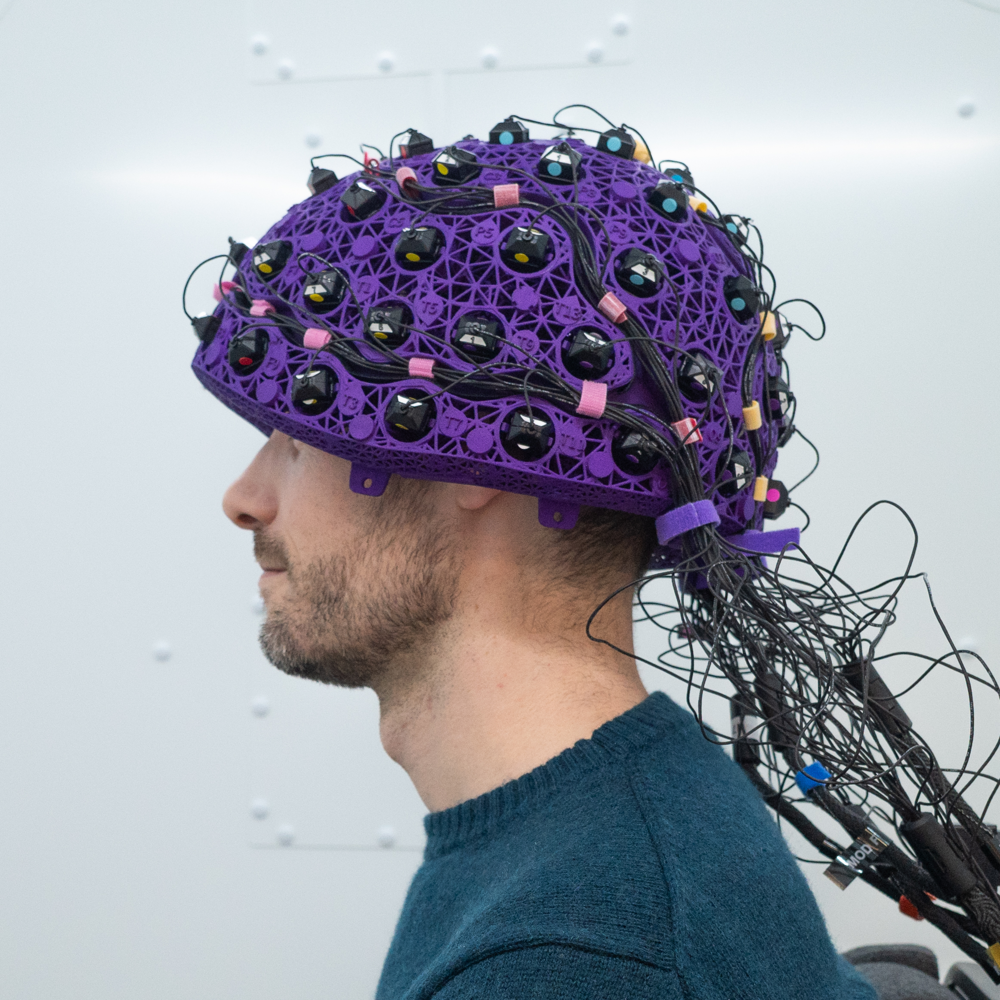
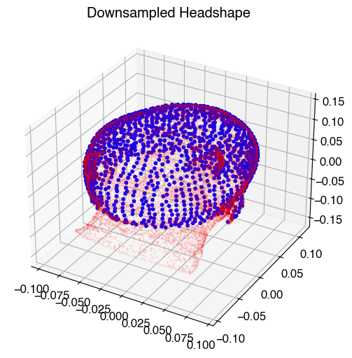
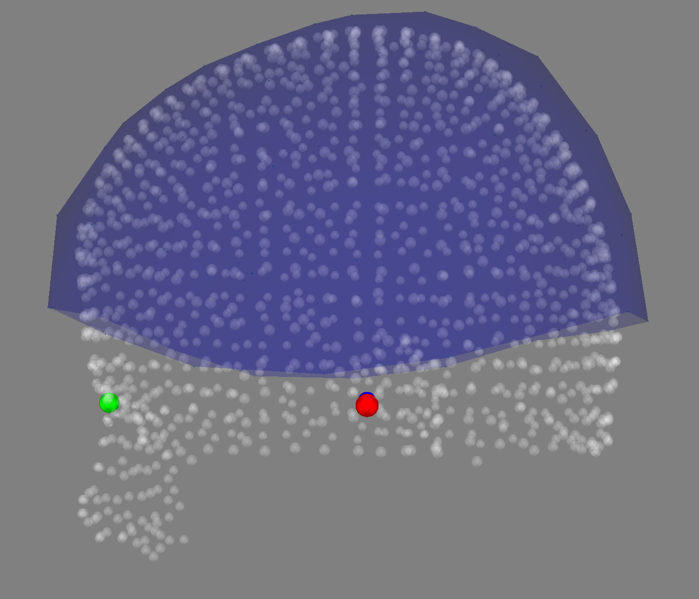
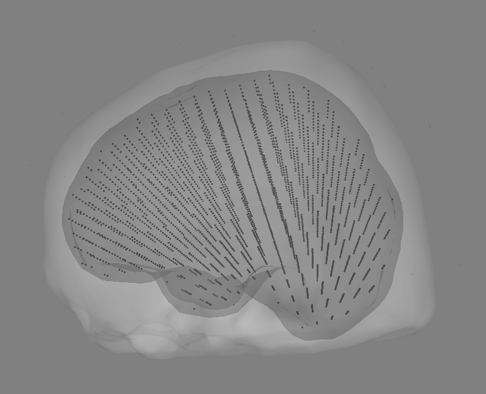
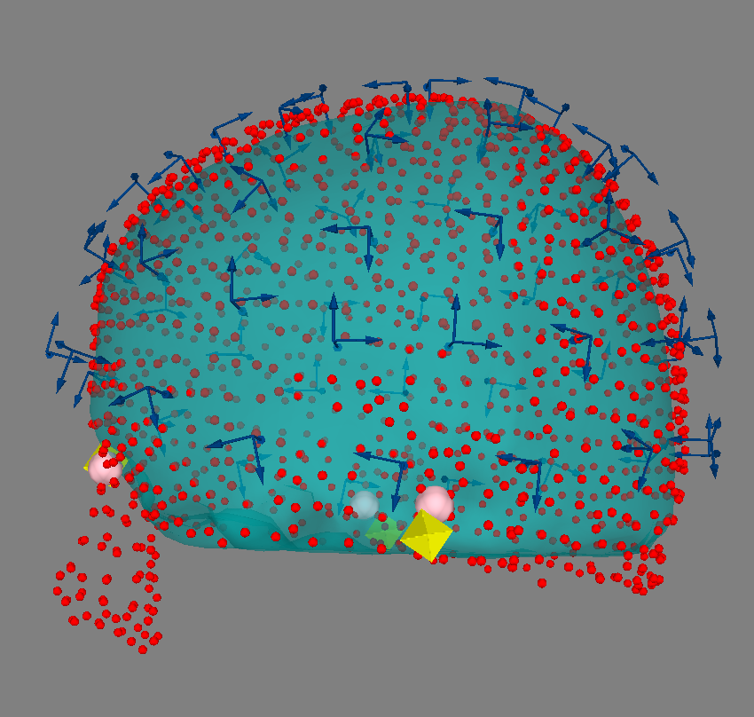
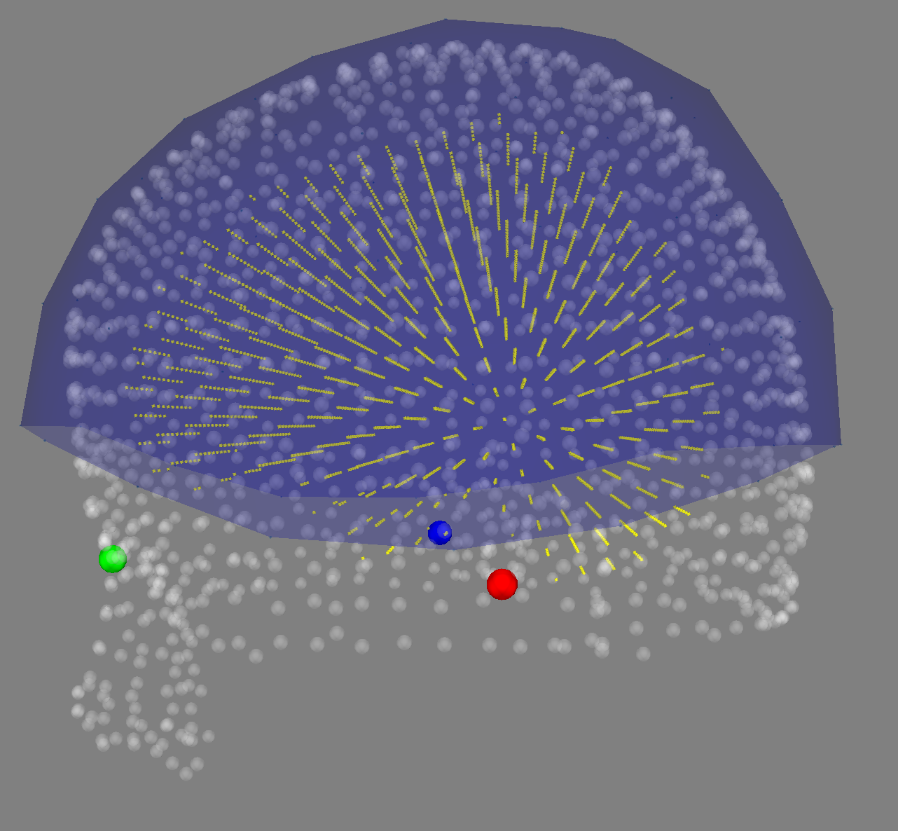

# OPM-MEG Tutorials in OSL: Coregistration using RHINO

### Note: data collected at Oxford OPM Lab December 2024

### Cerca Magnetics Neuro-1, 64-sensor QZFM OPM System




```python
# We start by importing the relevant packages
import osl_ephys
import numpy as np
import mne
import glob
import yaml
import os
import matplotlib.pyplot as plt

# Set global font to Open Sans
plt.rcParams['font.family'] = 'sans-serif'
plt.rcParams['font.sans-serif'] = ['Helvetica']
plt.rcParams['font.size'] = 12  # Adjust font size as desired

```

## Get FSL Setup


```python
from osl_ephys import source_recon
fsl_dir = '/Users/robertseymour/fsl'
source_recon.setup_fsl(fsl_dir)
```

## Specify Subject


```python
subject     = '001'
ses         = '001'
task        = 'fourMotor'
```

## Downsample Headshape and Save

One of the major differences when working with data from the CERCA Magnetics system is the inclusion of headshape data from the handheld 3D EinScan. This usually gives a very dense mesh of the head, face, and neck. A lot of the points are redundant (making ICP more likely to get stuck in local minima) and some parts of the mesh don’t line up with a typical structural MRI. To get around this, we can use the ```downsample_headshape``` function with the specific parameters listed below. These settings work well for adults when the fiducials are placed correctly, but they can be less reliable for children with smaller heads.


```python
from osl_ephys.source_recon.rhino.utils import downsample_headshape, replace_headshape

%matplotlib inline

filename = 'BIDS/sub-{}/ses-{}/meg/sub-{}_ses-{}_task-{}_run-001_meg.fif'.format(subject, ses, subject, ses,task)
raw = mne.io.read_raw_fif(filename, preload=True)

# Get Headshape Points
dig = raw.info['dig']
points = np.array([d['r'] for d in dig if 'r' in d])
print(np.shape(points))

# Downsample
ds_headshape = downsample_headshape(
    points,
    downsample_amount=0.01,        # Downsample head mesh (1 cm bins)
    include_facial_info=True,      # Keep facial points for ICP
    remove_zlim=-0.02,             # Remove >2 cm below nasion
    angle=0,                       # No rotation
    method="gridaverage",          # Grid-based averaging
    face_Z=[-0.06, 0.02],          # Keep face: -6 to +2 cm (up-down)
    face_Y=[0.06, 0.15],           # 6–15 cm forward
    face_X=[-0.03, 0.03],          # ±3 cm left-right
    downsample_facial_info=True,   
    downsample_facial_info_amount=0.01  # Downsample face (1 cm bins)
    # shift_inward=True,           # Optional inward shift - coming soon
)

# Assume `raw` is your loaded MNE Raw object, and `ds_headshape` is the Nx3 array of downsampled points
raw_C = replace_headshape(raw, ds_headshape)

# Plot the sensors to check they are in the right orientation
fig = mne.viz.plot_alignment(raw_C.info, dig=True)

# Save the data without duplicating the .fif extension
print('Saving...')
output_filename = '{}_hs_downsample-raw.fif'.format(filename.rstrip('.fif'))
raw_C.save(output_filename, overwrite=True)

```

    Opening raw data file BIDS/sub-001/ses-001/meg/sub-001_ses-001_task-fourMotor_run-001_meg.fif...
        Range : 0 ... 2198783 =      0.000 ...  1465.855 secs
    Ready.
    Reading 0 ... 2198783  =      0.000 ...  1465.855 secs...
    (15099, 3)
    Removing Points Below Z_lim


    

    



## Reload the downsampled headshape version of the raw file


```python
filename = 'BIDS/sub-{}/ses-{}/meg/sub-{}_ses-{}_task-{}_run-001_meg_hs_downsample-raw.fif'.format(subject,ses,subject,ses,task)
raw = mne.io.read_raw_fif(filename, preload=True)
```

## Setup subjects_dir and the structural MRI


```python
subjects_dir = 'coreg_ses-{}'.format(ses)
mri_file     = '{}.nii'.format(subject)
```

## Run MRI through FSL


```python
source_recon.rhino.compute_surfaces(
    mri_file,
    subjects_dir=subjects_dir,
    subject=subject,
    include_nose=True,
    do_mri2mniaxes_xform=True
)
```

## Save the headshape data to the right place in subjects_dir


```python
from osl_ephys.source_recon.rhino.utils import save_polhemus_fif
save_polhemus_fif(raw,subjects_dir=subjects_dir,subject=subject)
```

    Saved files to coreg_ses-001/001/rhino/coreg


## Use RHINO to do the Coreg!


```python
source_recon.rhino.coreg(
    filename,
    subjects_dir=subjects_dir,
    subject=subject,
    use_headshape=True,
    use_nose=True,
    allow_smri_scaling=False,
    n_init = 10,
)
```

### Display Headmodel


```python
source_recon.rhino.bem_display(
    subjects_dir=subjects_dir,
    subject=subject,
    display_outskin_with_nose=False,
    display_sensors=True,
    plot_type="surf",
)
```



## Display Coreg Accuracy
Note: requires the sensor type to be added to *_3d.py* MNE code - I need to make a pull request to MNE


```python
source_recon.rhino.coreg_display(
    subjects_dir=subjects_dir,
    subject=subject,
    display_outskin_with_nose=False,
    display_sensors=True,
    display_sensor_oris = True,
    plot_type="surf",
    display_headshape_pnts=True,
    display_outskin = True,
    # filename='./bem_dispay.html',

)
```



### Create 8mm single-shell grid


```python
gridstep = 8
source_recon.rhino.forward_model(
    subjects_dir=subjects_dir,
    subject=subject,
    model="Single Layer",
    gridstep=gridstep,
)
```

### Read Forward Solution and Plot


```python
from mne import read_forward_solution

# load forward solution
fwd_fname = os.path.join(subjects_dir, subject, "rhino", "model-fwd.fif")
fwd = read_forward_solution(fwd_fname)

# Visualize the forward solution using plot_alignment() (corrected)
mne.viz.plot_alignment(
    raw.info,  # Use the 'info' from the forward solution
    dig=True,
    subject=subject,  # Name of the subject
    subjects_dir=subjects_dir,  # Path to the subject's MRI directory
    src=fwd['src'],
)
```



