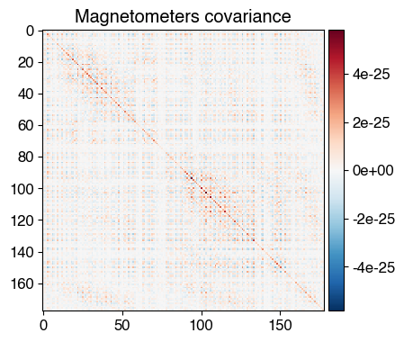
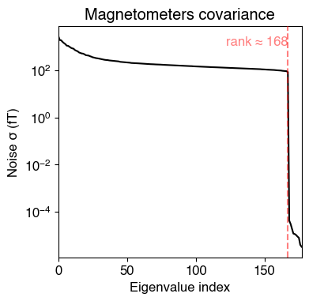
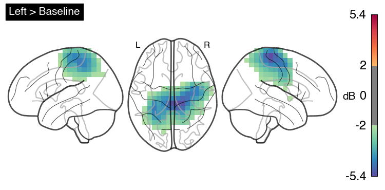
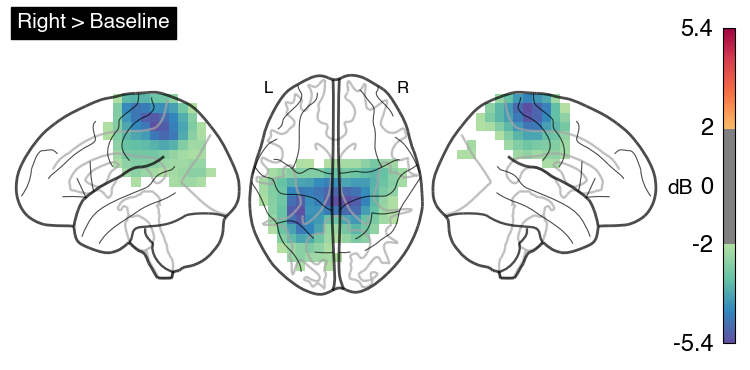
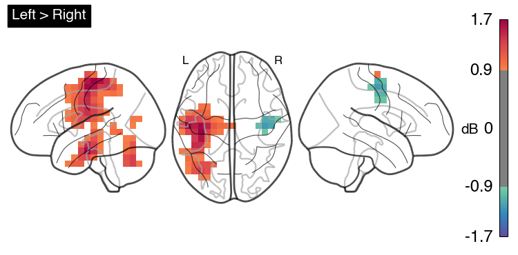

# OPM-MEG Tutorials in OSL: Source Localisation

### Note: data collected at Oxford OPM Lab December 2024

### Cerca Magnetics Neuro-1, 64-sensor QZFM OPM System


## In this tutorial we will source localise the alpha-beta spectral changes during movement we found at the sensor-level using MNE's LCMV beamformer. However unlike MNE's typical source localisation pipeline, here we use the volumetric grid generated by osl-ephys' RHINO


```python
# We start by importing the relevant packages
import osl_ephys
import numpy as np
import mne
import glob
import yaml
import os
import matplotlib.pyplot as plt

# Set global font to Open Sans
plt.rcParams['font.family'] = 'sans-serif'
plt.rcParams['font.sans-serif'] = ['Helvetica']
plt.rcParams['font.size'] = 12  # Adjust font size as desired

%matplotlib inline

```

## Specify Subject and subjects_dir


```python
subject      = '001'
ses          = '001'
task         = 'fourMotor'
subjects_dir = 'coreg_ses-{}'.format(ses)
```

## Load in the Clean Data (after pre-processing)


```python
output_dir = 'BIDS/derivatives/preprocessing/sub-{}/ses-{}/meg'.format(subject,ses)
output_file = 'sub-{}_ses-{}_task-{}_run-001_clean.fif'.format(subject,ses,task)
filename = os.path.join(output_dir, output_file)
clean = mne.io.read_raw_fif(filename, preload=True)
```

## Band-Pass Filter from 8-30Hz - this covers mu and beta-band


```python
# Use Butterworth IIR filter instead of FIR
iir_params = dict(order=4, ftype='butter')
clean.filter(l_freq=8.0, h_freq=30.0, method='iir', iir_params=iir_params)
```

## Split the pre-processed data into epochs based on the embdeeded triggers

#### Note, we generated the events structure in tutorial 01


```python
# Load events from .npy file
events = np.load('events.npy')
event_id = {'left_arm': 1, 'left_leg': 2, 'right_arm': 3, 'right_leg': 4}
epochs = mne.Epochs(clean, events, event_id = event_id, tmin=-3, tmax=7,preload=True,event_repeated='drop')

# Now Split into Left and Right Trials
left  = epochs['left_arm','left_leg']
right = epochs['right_arm','right_leg']

```

#### Specify the time windows:
- Left Arm/Leg      +1 to +4 seconds
- Right Arm/Leg     +1 to +4 seconds
- Baseline          -3 to +3 seconds


```python
# Now specify the correct time-windows
left      =  left.copy().crop(tmin = 1, tmax=4)
right     =  right.copy().crop(tmin=1, tmax=4)
baseline  =  epochs.copy().crop(tmin=-3, tmax=0)
```

## Quantify Covariance

#### First we compute covariance matrix across ALL time-points to compute a common filter, then condition specific covariance matrices are generated.

#### We can see the rank is automatically estimated at 168 (reduction due to HFC + ICA component removal)


```python
cov_all      = mne.compute_covariance(epochs, method='empirical')
cov_left     = mne.compute_covariance(left, method='empirical')
cov_right    = mne.compute_covariance(right, method='empirical')
cov_baseline = mne.compute_covariance(baseline, method='empirical')

# Plot the covariance matrix
fig_cov = mne.viz.plot_cov(cov_all, epochs.info)

```
    

    

    

    


### Read the Pre-Computed Forward Solution


```python
from mne import read_forward_solution

# load forward solution
fwd_fname = os.path.join(subjects_dir, subject, "rhino", "model-fwd.fif")
fwd = read_forward_solution(fwd_fname)
```

## Beamform!

#### Here we use MNE's LCMV beamformer with 5% regularisation and covariance across all trials and times. 

#### Occasionally MNE estimates the rank incorrectly in OPM-MEG data due to multiple 'cliffs'. In these cases I use the code below to adjust the rank downwards.


```python
rank = mne.compute_rank(clean)
rank['mag'] = rank['mag']-1
print(rank)
```

```python
from mne.beamformer import apply_lcmv_cov, make_lcmv

filters = make_lcmv(epochs.info, 
                            fwd, 
                            cov_all, 
                            reg=0.05,
                            noise_cov=None, 
                            pick_ori='max-power',
                            rank=rank
                            ) 

```


```python
# Apply LCMV filter to each covariance matrix
stc_left     = apply_lcmv_cov(cov_left, filters)
stc_right    = apply_lcmv_cov(cov_right, filters)
stc_baseline = apply_lcmv_cov(cov_baseline, filters)
```

## Plot Left Arm/Leg vs. Baseline in dB


### Below is a generic function to compute the difference between two source estimates (volumetric) using dB, followed by a spatial smoothing step


```python
import numpy as np
from fsl import wrappers as fsl_wrappers
from osl_ephys.source_recon.rhino.utils import recon_timeseries2niftii

def compute_and_save_dB(
    baseline_stc,
    active_stc,
    subjects_dir,
    subject,
    output_file,
    spatial_resolution=8,
    reference_brain='mni',
    smooth_fwhm=5,
):
    """
    Compute dB difference between active and baseline source estimates,
    save as NIfTI, and apply spatial smoothing.

    Parameters
    ----------
    baseline_stc : mne.SourceEstimate
        Baseline source estimate.
    active_stc : mne.SourceEstimate
        Active condition source estimate.
    subjects_dir : str
        Path to FreeSurfer SUBJECTS_DIR.
    subject : str
        Subject identifier.
    output_file : str
        Output filename for the unsmoothed NIfTI (e.g., 'output.nii').
    spatial_resolution : float, optional
        Spatial resolution in mm. Default is 8.
    reference_brain : str, optional
        Reference brain space (e.g., 'mni'). Default is 'mni'.
    smooth_fwhm : float, optional
        Full-width at half-maximum (FWHM) for Gaussian smoothing in mm.
        Default is 5.

    Returns
    -------
    smoothed_file : str
        Path to the smoothed NIfTI file.
    """
    # Compute dB
    dB = 20 * np.log10(active_stc.data / baseline_stc.data)

    # Create new SourceEstimate with dB data
    stc_dB = active_stc.copy()
    stc_dB.data = dB

    # Save to NIfTI
    recon_timeseries2niftii(
        subjects_dir,
        subject,
        stc_dB.data,
        output_file,
        spatial_resolution=spatial_resolution,
        reference_brain=reference_brain,
        times=None,
    )

    # Generate smoothed filename
    smooth_file = output_file.replace(".nii", "_smooth.nii.gz")

    # Apply smoothing with FSL
    fsl_wrappers.fslmaths(output_file).s(smooth_fwhm).run(smooth_file)

    return smooth_file

```


```python
smoothed_file = compute_and_save_dB(
    baseline_stc=stc_baseline,      # your baseline SourceEstimate
    active_stc=stc_left,            # your active SourceEstimate
    subjects_dir=subjects_dir,      # FreeSurfer SUBJECTS_DIR
    subject=subject,                # subject name/ID
    output_file=f"left_stc_dB_diff-ses{ses}.nii",  # unsmoothed NIfTI filename
    spatial_resolution=8,           # mm resolution
    reference_brain="mni",          # reference space
    smooth_fwhm=5                   # Gaussian smoothing FWHM in mm
)

print("Smoothed NIfTI saved at:", smoothed_file)
```

#### Plot the smoothed file using a glass-brain


```python
from nilearn import image, plotting

# Save the plot as a PNG image with 500 DPI
display = plotting.plot_glass_brain(smoothed_file, title='Left > Baseline',
                          threshold=2, colorbar=True, cmap="Spectral_r", plot_abs=False,
                          display_mode="lzr")

# Add the colorbar label using Matplotlib
cbar = display._cbar
cbar.set_label('dB', fontsize=15)
cbar.ax.tick_params(labelsize=17)
cbar.ax.yaxis.set_label_position('left')
cbar.ax.yaxis.set_label_coords(-3.5, 0.46)
cbar.ax.yaxis.label.set_rotation(0)  # Set the label orientation to upright

# Show plot
plt.show()
```


    

    


## Plot Right Arm/Leg vs. Baseline


```python
smoothed_file = compute_and_save_dB(
    baseline_stc=stc_baseline,      # your baseline SourceEstimate
    active_stc=stc_right,            # your active SourceEstimate
    subjects_dir=subjects_dir,      # FreeSurfer SUBJECTS_DIR
    subject=subject,                # subject name/ID
    output_file=f"right_stc_dB_diff-ses{ses}.nii",  # unsmoothed NIfTI filename
    spatial_resolution=8,           # mm resolution
    reference_brain="mni",          # reference space
    smooth_fwhm=5                   # Gaussian smoothing FWHM in mm
)

print("Smoothed NIfTI saved at:", smoothed_file)
```


```python
from nilearn import image, plotting

# Save the plot as a PNG image with 500 DPI
display = plotting.plot_glass_brain(smoothed_file, title='Right > Baseline',
                          threshold=2, colorbar=True, cmap="Spectral_r", plot_abs=False,
                          display_mode="lzr")

# Add the colorbar label using Matplotlib
cbar = display._cbar
cbar.set_label('dB', fontsize=15)
cbar.ax.tick_params(labelsize=17)
cbar.ax.yaxis.set_label_position('left')
cbar.ax.yaxis.set_label_coords(-3.5, 0.46)
cbar.ax.yaxis.label.set_rotation(0)  # Set the label orientation to upright

# Show plot
plt.show()
```


    

    


## Plot Left vs. Right Movements


```python
smoothed_file = compute_and_save_dB(
    baseline_stc=stc_right,      # your baseline SourceEstimate
    active_stc=stc_left,            # your active SourceEstimate
    subjects_dir=subjects_dir,      # FreeSurfer SUBJECTS_DIR
    subject=subject,                # subject name/ID
    output_file=f"left_vs_right_stc_dB_diff-ses{ses}.nii",  # unsmoothed NIfTI filename
    spatial_resolution=8,           # mm resolution
    reference_brain="mni",          # reference space
    smooth_fwhm=5                   # Gaussian smoothing FWHM in mm
)

print("Smoothed NIfTI saved at:", smoothed_file)
```


```python
from nilearn import image, plotting

# Save the plot as a PNG image with 500 DPI
display = plotting.plot_glass_brain(smoothed_file, title='Left > Right',
                          threshold=0.9, colorbar=True, cmap="Spectral_r", plot_abs=False,
                          display_mode="lzr")

# Add the colorbar label using Matplotlib
cbar = display._cbar
cbar.set_label('dB', fontsize=15)
cbar.ax.tick_params(labelsize=17)
cbar.ax.yaxis.set_label_position('left')
cbar.ax.yaxis.set_label_coords(-3.5, 0.46)
cbar.ax.yaxis.label.set_rotation(0)  # Set the label orientation to upright

# Show plot
plt.show()
```


    

    

