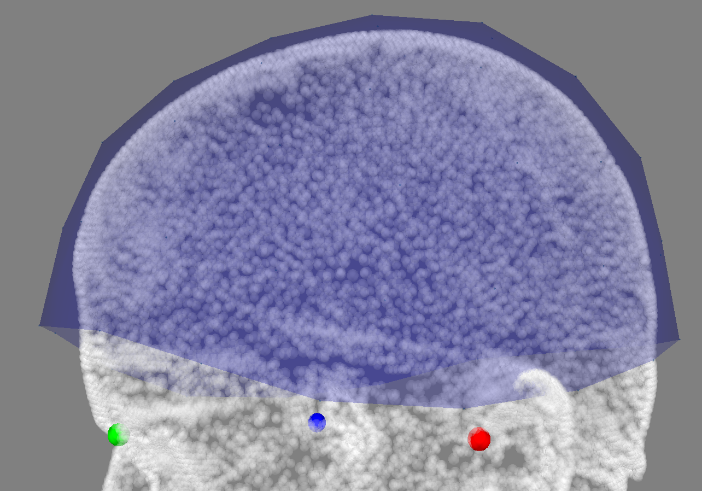
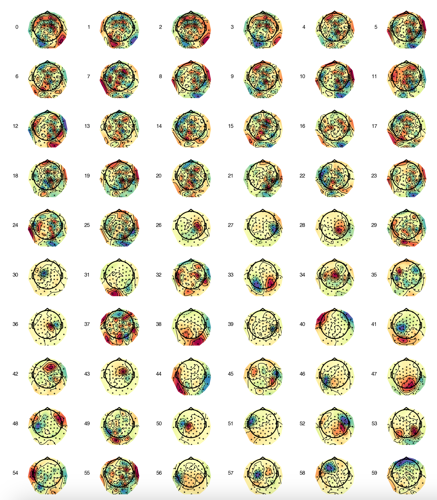
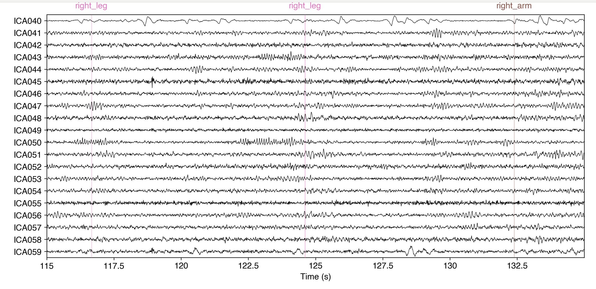

# OPM-MEG Tutorials in OSL: Pre-Processing

### Dataset overview
- Collected from the **Oxford OPM-MEG Lab**, December 2024
- One session, one run of data  
- **Cerca Magnetics Neuro-1 QZFM OPM system**
- **192 channels** total (64 sensor locations)  
- Each sensor has **X, Y, Z** channels corresponding to its sensitive orientation  


### ⚙️ Software requirements

These tutorials rely on **homogeneous field correction**  
(Tierney et al., 2021), which is only available in:

- **`MNE` ≥ 0.18**
- **`osl-ephys` ≥ 0.24**

Please ensure your environment is up to date before continuing.

## The Four-Motor Task

The participant hears an **audio cue** instructing them to move one of the following:

- ✋ Right arm  
- 🤚 Left arm  
- 🦵 Right leg  
- 🦿 Left leg  

Each movement is performed for **4 seconds**, followed by a **variable inter-stimulus interval**.


```python
# We start by importing the relevant packages
import osl_ephys
import numpy as np
import mne
import glob
import yaml
import os
import matplotlib.pyplot as plt

print('MNE version: {}'.format(mne.__version__))

# Print OSL-Ephys version
try:
    print('OSL-Ephys version: {}'.format(osl_ephys.__version__))
except AttributeError:
    from importlib.metadata import version
    print('OSL-Ephys version: {}'.format(version('osl-ephys')))

# Set global font to Open Sans
plt.rcParams['font.family'] = 'sans-serif'
plt.rcParams['font.sans-serif'] = ['Helvetica']
plt.rcParams['font.size'] = 12  # Adjust font size as desired

%matplotlib inline
```

## Specify Subject, Session and Task

```python
subject  = '001'
ses      = '001'
task     = 'fourMotor'
run      = '001'

data_dir = os.path.join(os.getcwd(),'study-FourMotorOPM')
```

## Load in the Data

```python
filename = os.path.join(
    data_dir,
    'BIDS',
    f'sub-{subject}',
    f'ses-{ses}',
    'meg',
    f'sub-{subject}_ses-{ses}_task-{task}_run-{run}_meg.fif'
)

raw = mne.io.read_raw_fif(filename, preload=True)
```

## Plot Sensor Layout and Headshape in 3D

```python
# Plot the sensors to check they are in the right orientation
fig = mne.viz.plot_alignment(raw.info,dig=True)
```

Note, the very dense headshape we get from the 3D scanner.



## Plot the Raw Data

### Note the very large low-frequency artefacts when the person is moving (this is normal!)

```python
# Plot the first 10s of raw data
raw.plot(highpass=1,
         lowpass=110.0,scalings = {'mag' : 1e-10},
         duration=40,butterfly=False,picks='mag')
```


```python
fig = plt.figure()
ax2d = fig.add_subplot(121)
ax3d = fig.add_subplot(122, projection="3d")
raw.plot_sensors(ch_type="mag", axes=ax2d)
raw.plot_sensors(ch_type="mag", axes=ax3d, kind="3d")
ax3d.view_init(azim=70, elev=15)
```


## Add in channels we know are bad - H6, A3, G8

```python
# Add in channels we know are bad
import re

pattern = r'\b(H6|A3|G8) [XYZ]\b' # Modify accordingly
matched_channels = [ch for ch in raw.info.ch_names if re.search(pattern, ch)]

raw.info['bads'].extend(matched_channels)
```

## Downsample the data to 300Hz

```python
x = raw.copy().pick(picks=['mag'])
raw_downsampled = x.copy().resample(sfreq=300)
```

## Mark Bad Segments Based on Kurtosis

#### This seems to work well for the square wave jumps present in this particular dataset (now fixed)

```python
from osl_ephys.preprocessing.osl_wrappers import bad_segments

raw_downsampled = bad_segments(
    raw_downsampled,
    picks='mag',
    segment_len=300,
    significance_level=0.05,
    metric='kurtosis',
    channel_wise = False
)
```

```python
Z_picks = mne.pick_channels_regexp(raw_downsampled.info['ch_names'], regexp=r".*Z$")
raw_downsampled.plot(start=20,duration=10,picks=Z_picks,n_channels=64,highpass=2.0,
           butterfly=False,scalings = {'mag' : 1e-11})
```


## Plot the Power Spectral Density (PSD)

### Note we have some bad channels!

```python
psd = raw_downsampled.compute_psd(fmin=1, fmax=150, n_fft=2000,reject_by_annotation=True)

# Plot the PSD
fig = psd.plot()  # This now returns a figure

# Get the axis object from the figure
ax = fig.axes[0]  # Since psd.plot() returns an array, we need to index into the first axis

# # Set the y-axis limits
ax.set_ylim(1, 100)

plt.show()
```


## Detect Bad Chans from the PSD using GESD

Generalized Extreme Studentized Deviate (GESD) is a statistical method for finding outlier channels in MEG data. When applied to power spectral density measures it looks for sensors whose power is much higher or lower than the rest of the array. The method works by identifying the most extreme channel testing whether it is unlikely to occur by chance and then repeating this process after removing it. This makes GESD well suited for automated bad channel detection in OPM-MEG because it can reliably flag noisy or malfunctioning sensors without requiring the number of bad channels to be set in advance.

```python
from osl_ephys.preprocessing.osl_wrappers import detect_bad_channels_psd

# Example usage
bad_channels = detect_bad_channels_psd(raw_downsampled, fmin=10, fmax=80, alpha=0.05)
print("Detected bad channels:", bad_channels)
```

### Now we can remove the bad channels

```python
%matplotlib inline

# Add these channels as bad
raw_downsampled.info['bads'].extend(bad_channels)
psd = raw_downsampled.compute_psd(fmin=1, fmax=150, n_fft=3000,reject_by_annotation=True)

# Plot the PSD
fig = psd.plot()  # This now returns a figure
# Get the axis object from the figure
ax = fig.axes[0]  # Since psd.plot() returns an array, we need to index into the first axis
# # Set the y-axis limits
ax.set_ylim(2, 100)
plt.show()
```

## Find Events (trial onsets)

```python
import os
import numpy as np
import mne

# Annotation labels to look for (combined into a regex)
pattern_list = ['left_arm', 'left_leg', 'right_arm', 'right_leg']
pattern = '|'.join(pattern_list)
print(f"Extracting events for: {pattern_list}")

# Extract events from annotations using the regex pattern
events, event_ids = mne.events_from_annotations(
    raw_downsampled,
    regexp=pattern
)

print(f"Number of events found: {len(events)}")
print(f"Event ID mapping: {event_ids}")

# Create BIDS derivatives directory for events
events_dir = os.path.join(
    data_dir, 'BIDS', 'derivatives', 'event',
    f'sub-{subject}', f'ses-{ses}', 'meg'
)
os.makedirs(events_dir, exist_ok=True)
print(f"Events directory created/exists: {events_dir}")

# Save the events array
events_file = os.path.join(
    events_dir,
    f'sub-{subject}_ses-{ses}_task-{task}_run-{run}_events.npy'
)
np.save(events_file, events)
print(f"Events saved to: {events_file}\n")
```

## Homogenous Field Correction (HFC) - Order 1 and 2

Homogeneous Field Correction (HFC) estimates and subtracts the spatially homogeneous component of the magnetic field from OPM recordings, suppressing environmental and movement-related noise while retaining neural signal.

Specify order = 1 for homogenous field or = 2 to also include gradients

```python
# Compute projections and apply them
projs1 = mne.preprocessing.compute_proj_hfc(raw_downsampled.info, order=1)
raw_hfc1 = raw_downsampled.copy().add_proj(projs1).apply_proj(verbose="error")

projs2 = mne.preprocessing.compute_proj_hfc(raw_downsampled.info, order=2)
raw_hfc2 = raw_downsampled.copy().add_proj(projs2).apply_proj(verbose="error")

# Compute PSDs
psd      = raw_downsampled.compute_psd(fmin=0, fmax=120, picks='mag', n_fft=2000)
psd_HFC1 = raw_hfc1.compute_psd(fmin=0, fmax=120, picks='mag', n_fft=2000)
psd_HFC2 = raw_hfc2.compute_psd(fmin=0, fmax=120, picks='mag', n_fft=2000)

# Extract data and freqs
psd_raw_data, freqs = psd.get_data(return_freqs=True)
psd_hfc1_data, _    = psd_HFC1.get_data(return_freqs=True)
psd_hfc2_data, _    = psd_HFC2.get_data(return_freqs=True)

# Compute shielding in dB (raw vs HFC2)
shielding = 10 * np.log10(psd_raw_data / psd_hfc2_data)

# --- Plot shielding ---
fig, ax = plt.subplots(figsize=(6, 4), layout="constrained")
ax.plot(freqs, shielding.T, lw=1, alpha=0.5)                  # all channels
ax.plot(freqs, shielding.mean(axis=0), lw=4, alpha=1, color='black')  # mean
ax.grid(True, ls=":")
ax.set(
    xlim=(0, 120),
    title="Shielding After HFC (Order=2)",
    xlabel="Frequency (Hz)",
    ylabel="Shielding (dB)",
)

# --- Plot PSD after HFC (Order=2) ---
fig = psd_HFC2.plot()  # This now returns a figure
ax = fig.axes[0]  # Since psd.plot() returns an array, we need to index into the first axis
ax.set_ylim(2, 100)
plt.show()
```


### Band-Pass using a Butterworth filter (2-50 Hz) and Notch Filter (50, 100 Hz)

```python
# BP Filter
raw_bp = raw_hfc2.copy().filter(
    l_freq=2,
    h_freq=50,
    method='iir',                # use IIR (Butterworth)
    iir_params=dict(ftype='butter', order=4),  # 4th-order Butterworth
    verbose=True
)

# Notch Filter
freqs = (50, 100)
raw_notch = raw_bp.copy().notch_filter(freqs=freqs, picks='mag',notch_widths=2)
```

## Save the Intermediate Data

```python
import os

# Directory where the pre-ICA MEG file will be saved (BIDS-style derivatives)
output_dir = os.path.join(data_dir,
    "BIDS", "derivatives", "preprocessing",
    f"sub-{subject}", f"ses-{ses}", "meg"
)

# Output filename for the pre-ICA cleaned data
output_file = f"sub-{subject}_ses-{ses}_task-{task}_run-{run}_preICA.fif"

# Create the output directory if it does not already exist
os.makedirs(output_dir, exist_ok=True)

# Full path to the output file
output_path = os.path.join(output_dir, output_file)

# Save the Raw object to disk
raw_notch.save(output_path, overwrite=True)

print(f"Pre-ICA data saved to: {output_path}")
```

## ICA

The ICA model is configured using the following parameters:

- **`n_components = 60`**  
  Controls the number of independent components to estimate. For MEG data, this is often set to a value lower than the total number of sensors to improve numerical stability while still capturing the dominant structure of the data.

- **`random_state = 34`**  
  Fixes the random seed used during ICA initialization. This ensures the decomposition is reproducible across runs, which is important for debugging and for comparisons across subjects or sessions.

- **`max_iter = 800`**  
  Specifies the maximum number of iterations allowed for the algorithm to converge. Higher values can help ensure convergence when working with noisy MEG or OPM-MEG recordings.

- **`method = "fastica"`**  
  Selects the FastICA algorithm, which is computationally efficient and widely used in MEG preprocessing pipelines. You could use a fancier ICA variant, but in my experience this suffices 99% of the time.


```python
from mne.preprocessing import ICA
from mne.viz import plot_topomap
import numpy as np

# Compute ICA on all channels (use raw_notch as input)
ica = ICA(n_components=60, random_state=34, max_iter=800,method='fastica')
ica.fit(raw_notch)  # Fit ICA on all channels
```

### Plot ICA sources - the default osl-ephys plotter cannot only plot the Z-orientation

```python
%matplotlib qt

browser = ica.plot_sources(raw_notch, show_scrollbars=False)
browser.show()  # Show it if not already visible

# Access the underlying Qt window and resize
qt_window = browser.canvas.parent()
qt_window.resize(1200, 600)

from mne.viz import plot_topomap
import math

def plot_ica_topomaps_Z(raw_notch, ica, batch_size=10, colormap='RdBu_r'):
    """
    Plot ICA components as topomaps for selected good Z channels, displaying them in batches.
    """

    # Get good channels
    all_channels = raw_notch.info['ch_names']
    bad_channels = raw_notch.info['bads']
    good_channels = [ch for ch in all_channels if ch not in bad_channels]

    # Get channels matching the regex pattern
    Z_picks = mne.pick_channels_regexp(all_channels, regexp=r".*Z$")
    Z_channels = [all_channels[i] for i in Z_picks]

    # Keep only good Z channels
    Z_good_channels = [ch for ch in Z_channels if ch in good_channels]

    # Get ICA channel names
    ica_channels = ica.info['ch_names']

    # Indices of Z good channels in ICA
    Z_good_ica_picks = [ica_channels.index(ch) for ch in Z_good_channels]

    # Use only info (no data copy) for plotting
    raw_info_Z = raw_notch.copy().pick_channels(Z_good_channels).info

    # Get ICA components
    ica_data = ica.get_components()
    num_components = ica.n_components_

    # Suppress interactive rendering
    plt.ioff()

    # Loop through components in batches
    for i in range(0, num_components, batch_size):
        num_subplots = min(batch_size, num_components - i)
        rows = int(math.ceil(num_subplots / 6))  # 6 columns
        cols = 6

        fig, axes = plt.subplots(rows, cols, figsize=(7, 12))
        axes = axes.ravel()

        for idx, comp in enumerate(range(i, min(i + batch_size, num_components))):
            comp_data = ica_data[Z_good_ica_picks, comp]
            ax = axes[idx]

            plot_topomap(comp_data, raw_info_Z, axes=ax, show=False,
                         size=3, cmap=colormap)

            ax.text(-0.2, 0.5, f'{comp}', transform=ax.transAxes,
                    fontsize=6, va='center', ha='right')

        # Hide unused axes
        for j in range(idx + 1, len(axes)):
            axes[j].axis('off')

        plt.tight_layout()

    # Render all figures at once
    plt.show()
    plt.ion()

plot_ica_topomaps_Z(raw_notch, ica, batch_size=60, colormap='Spectral_r')
```

Component 40 corresponds to an eye-blink artefact and 59 is a horizontal eye-movement artefact (note, the frontal topography of the component and sharper jumps)





### Manually specify the components to exclude

```python
ica.exclude = [40,59]  # indices chosen based on various plots above

# # Remove bad components from the data
clean = ica.apply(raw_notch.copy())
```

### Plot again

```python
%matplotlib inline
Z_picks = mne.pick_channels_regexp(clean.info['ch_names'], regexp=r".*Z$")
clean.plot(start=20,duration=10,picks=Z_picks,n_channels=64,
           butterfly=False,scalings = {'mag' : 1e-11})
# plt.savefig('clean_plot.png', dpi=300, bbox_inches='tight')
```

## Save the Clean Data

```python
# Directory where the cleaned MEG data will be saved (BIDS derivatives)
output_dir = os.path.join(
    data_dir,
    "BIDS", "derivatives", "preprocessing",
    f"sub-{subject}", f"ses-{ses}", "meg"
)

# Filename for the cleaned dataset
output_file = f"sub-{subject}_ses-{ses}_task-{task}_run-{run}_clean.fif"

# Create the output directory if it does not already exist
os.makedirs(output_dir, exist_ok=True)

# Full path to the output file
output_path = os.path.join(output_dir, output_file)

# Save the cleaned Raw object to disk
clean.save(output_path, overwrite=True)

print(f"Cleaned data saved to: {output_path}")
```

