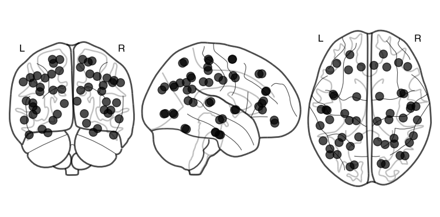
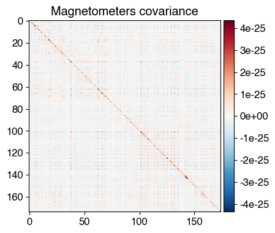
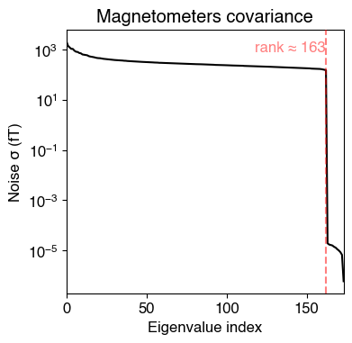
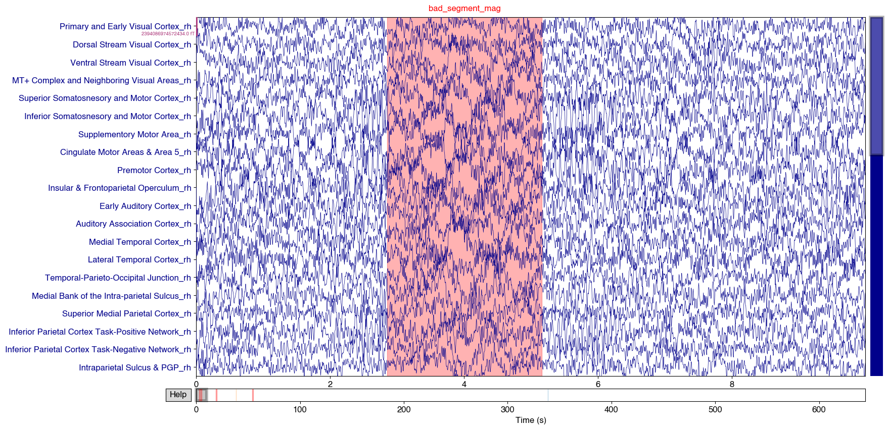
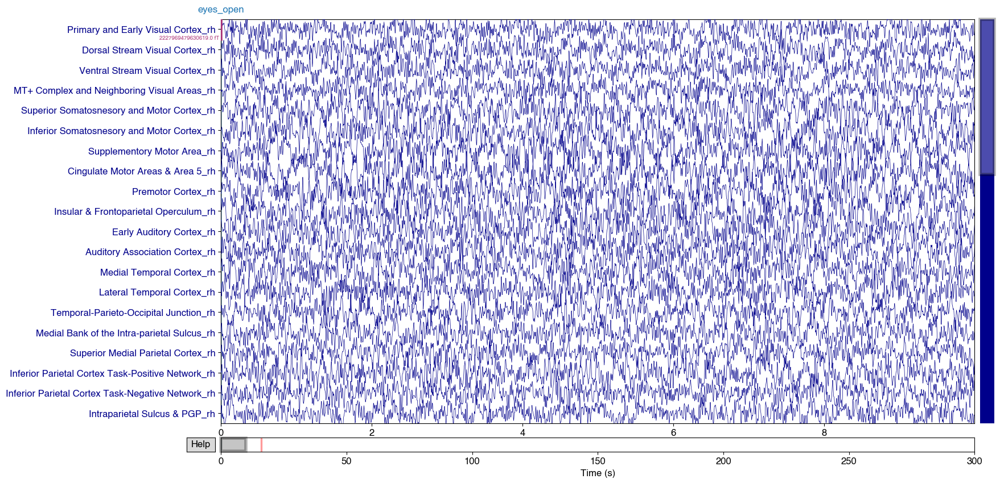
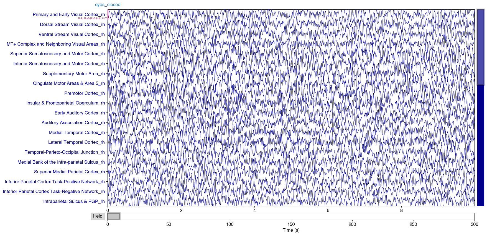
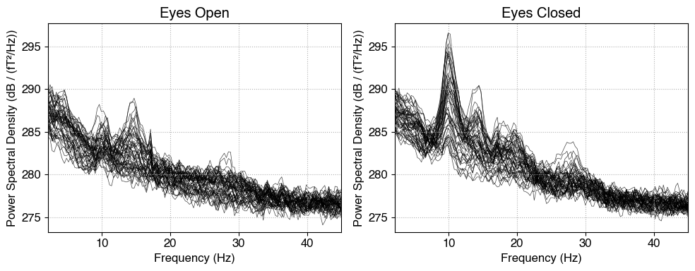
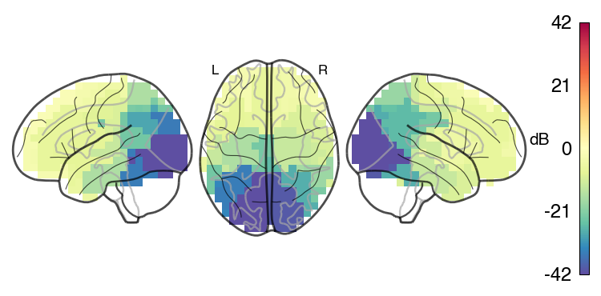

# Script to Parcellate some Resting-State OPM-MEG Data Collected at Oxford

### This dataset contains OPM-MEG resting-state recordings collected over a 10-minute session, divided into two consecutive conditions:

#### 5 minutes — Eyes Open 👀 / 5 minutes — Eyes Closed 😌

### The data has already been pre-processed:
- Filtered 2-60Hz + Notch Filter at 50 Hz
- Bad channels and bad segments marked
- Homogenous Field Correction applied (order = 2)
- Coregistration using RHINO has been performed


```python
# We start by importing the relevant packages
import osl_ephys
import numpy as np
import mne
import glob
import yaml
import os
import matplotlib.pyplot as plt
from osl_ephys.source_recon import rhino, beamforming, parcellation
import pickle
import os

# Set global font to Open Sans
plt.rcParams['font.family'] = 'sans-serif'
plt.rcParams['font.sans-serif'] = ['Helvetica']
plt.rcParams['font.size'] = 12  # Adjust font size as desired
```

```python
%matplotlib inline
```

## Specify Subject and subjects_dir and data_dir

```python
subject      = '005'
ses          = '001'
task         = 'rest'
run          = '001'
subjects_dir = 'subjects_dir/coreg_ses-{}'.format(ses)

data_dir = '/Volumes/Robert T5/study-RS_reliability'
```

## Load in the Clean Data (after pre-processing)


```python
output_dir = '{}/BIDS/derivatives/preprocessing/sub-{}/ses-{}/meg'.format(data_dir,subject,ses)
output_file = 'sub-{}_ses-{}_task-{}_run-{}_clean.fif'.format(subject,ses,task,run)
filename = os.path.join(output_dir, output_file)
```

## Setup the Parcellation


```python
parcellation_fname = 'Glasser52_binary_space-MNI152NLin6_res-8x8x8.nii.gz'
parcellation.plot_parcellation(parcellation_fname)

# This is temporary code - Mark has updated this to include parcel names in
labels_fname       = 'Labels.p'

with open(labels_fname, 'rb') as f:
    labels = pickle.load(f)

print(labels)

```

    

    

## Parcellate


```python
# Load raw data
clean = mne.io.read_raw_fif(filename, preload=True)
```


```python
# Compute and plot the rank
cov_all = mne.compute_raw_covariance(clean)

# Plot the covariance matrix
fig_cov = mne.viz.plot_cov(cov_all, clean.info)

# Compute the rank of the covariance matrix
rank = mne.compute_rank(cov_all, info=clean.info)

print("\nEstimated rank from covariance:")
for key, value in rank.items():
    print(f"{key}: {value}")

# I manually adjust this value down by 3 for safety when we invert the covariance matrix during beamforming
rank['mag'] = rank['mag'] - 3

```

    

   
    


### Find and Apply LCMV beamformer filters

```python
filters = beamforming.make_lcmv(
    subjects_dir,
    subject,
    clean,
    {'mag'},
    pick_ori="max-power-pre-weight-norm",
    reduce_rank=True,
    rank=rank,
)
print("Applying beamformer spatial filters")
```


```python
# Apply beamformer, keep bad segments for now
stc = beamforming.apply_lcmv(clean, filters, reject_by_annotation=None)
```

### Transform timeseries to MNI space

```python
recon_timeseries_mni, _, recon_coords_mni, _ = beamforming.transform_recon_timeseries(
    subjects_dir,
    subject,
    recon_timeseries=stc.data,
    reference_brain="mni"
)
print("Dimensions of reconstructed timeseries in MNI space (dipoles x tpts):", recon_timeseries_mni.shape)
```

### Parcellate source time series into atlas-defined brain regions

```python
parcel_ts, _, _ = parcellation.vol_parcellate_timeseries(
    parcellation_fname,   # atlas file (e.g. .nii.gz) defining parcels in MNI space
    recon_timeseries_mni, # source-level time series (time x vertices)
    recon_coords_mni,     # MNI coordinates of each vertex
    "spatial_basis",      # method: project using spatial basis maps
    None                  # no extra options
)
```

### Annotations

The conversion to MNE data structure automatically excludes bad segments (turns those segments to NaN or 0). To keep all data but mark the data as 'bad' we do some jiggery pokery to remove annotations, convert the parcellated time-series to an MNE structure then add the annotations back in.


```python
# Copy and remove annotations
annotations_copy = clean.annotations.copy()
clean.set_annotations(None)

# Convert parcellated timeseries to MNE Raw
parc_raw = parcellation.convert2mne_raw(parcel_ts, clean, labels)

# Restore annotations safely
try:
    parc_raw.set_annotations(annotations_copy)
except ValueError:
    print("Warning: could not restore annotations (time mismatch)")
```

```python
# Set all channels to magnetometers
parc_raw.set_channel_types({ch: 'mag' for ch in parc_raw.info['ch_names']})
```

### Plot

```python
parc_raw.plot(scalings='auto')
```
 



## Post-Processing

Now that we have the parcellated data we can analyse it! 

Here I am computing spectral power in the alpha band (8-12 Hz) and comparing eyes open versus eyes closed epochs

### Load Events File Computed Earlier

```python
output_dir = '{}/BIDS/derivatives/events/sub-{}/ses-{}/meg'.format(data_dir,subject,ses)
output_file = 'sub-{}_ses-{}_task-{}_events.npy'.format(subject,ses,task)

# Create the directory if it doesn't exist
os.makedirs(output_dir, exist_ok=True)

# Save the events file
events = np.load(os.path.join(output_dir, output_file))
```

### Cut into 2x 300s chunks

```python
# Define event codes for each condition
event_id = {'eyes_open': 2, 'eyes_closed': 1}

# Sampling frequency of the data
sfreq = parc_raw.info['sfreq']

# --- Eyes open (code 2) ---
# Find the sample index of the 'eyes open' event
eyes_open_idx = events[events[:, 2] == event_id['eyes_open'], 0]

# Check there is exactly one such event
if len(eyes_open_idx) != 1:
    raise ValueError(f"Expected 1 eyes-open event, found {len(eyes_open_idx)}")

# Convert event sample index to start/end times (seconds); extract 300 s segment
tmin, tmax = eyes_open_idx[0] / sfreq, eyes_open_idx[0] / sfreq + 300

# Copy raw data and crop to the eyes-open segment
eyes_open = parc_raw.copy().crop(tmin=tmin, tmax=tmax)

# --- Eyes closed (code 1) ---
# Find the sample index of the 'eyes closed' event
eyes_closed_idx = events[events[:, 2] == event_id['eyes_closed'], 0]

# Check there is exactly one such event
if len(eyes_closed_idx) != 1:
    raise ValueError(f"Expected 1 eyes-closed event, found {len(eyes_closed_idx)}")

# Convert event sample index to start/end times (seconds); extract 300 s segment
tmin, tmax = eyes_closed_idx[0] / sfreq, eyes_closed_idx[0] / sfreq + 300

# Copy raw data and crop to the eyes-closed segment
eyes_closed = parc_raw.copy().crop(tmin=tmin, tmax=tmax)

```

### Plot

```python
eyes_open.plot(scalings='auto', duration=10, title="Eyes Open")
eyes_closed.plot(scalings='auto', duration=10, title="Eyes Closed")
```


  



### Compute PSD


```python
import matplotlib.pyplot as plt

# Compute PSDs
psds_open = eyes_open.compute_psd(method='welch', fmin=2, fmax=45, n_fft=1000, picks='mag')
psds_closed = eyes_closed.compute_psd(method='welch', fmin=2, fmax=45, n_fft=1000, picks='mag')

# Create figure with 2 subplots
fig, axes = plt.subplots(1, 2, figsize=(10, 4))

# Plot PSDs using built-in method
psds_open.plot(axes=axes[0], show=False)
axes[0].set_title('Eyes Open')

psds_closed.plot(axes=axes[1], show=False)
axes[1].set_title('Eyes Closed')

# After plotting, read the y-limits from both subplots
ymin_open, ymax_open = axes[0].get_ylim()
ymin_closed, ymax_closed = axes[1].get_ylim()

# Compute global y-limits
ymin = min(ymin_open, ymin_closed)
ymax = max(ymax_open, ymax_closed)

# Set both subplots to the same y-limits
axes[0].set_ylim(ymin, ymax)
axes[1].set_ylim(ymin, ymax)

# Optional: add shared axis labels
for ax in axes:
    ax.set_xlabel('Frequency (Hz)')
    ax.set_ylabel('Power Spectral Density (dB / (fT²/Hz))')

plt.tight_layout()
plt.show()

```
    

    

### Segment the data into 2s chunks

```python
import mne
import numpy as np

def segment_epoched(epochs, duration=2):
    """
    Re-epoch the given epochs into fixed-length segments.

    Parameters:
    epochs : mne.Epochs
        The original epochs to be re-epoched.
    duration : float
        The duration of each segment in seconds.

    Returns:
    mne.Epochs
        The re-epoched data.
    """
    # Get the data and info from the original epochs
    data = epochs.get_data()
    info = epochs.info.copy()

    # Create a new RawArray from the epoched data
    raw_new = mne.io.RawArray(np.squeeze(data), info)

    # Re-epoch into fixed-length segments
    fixed_length_epochs = mne.make_fixed_length_epochs(raw_new, duration=duration, preload=True)

    return fixed_length_epochs

eyes_open_segmented     = segment_epoched(eyes_open, duration=2)
eyes_closed_segmented   = segment_epoched(eyes_closed, duration=2)

```


### Compute Time-Frequency Respresentations


```python
# Define frequencies of interest and number of cycles for Morlet wavelets
freqs = np.arange(8, 13, 1)  # 8-12 Hz
n_cycles = freqs / 3.  # Different number of cycles per frequency

# Compute TFR using Morlet wavelets
tfr_open   = mne.time_frequency.tfr_morlet(eyes_open_segmented, freqs=freqs, n_cycles=n_cycles, use_fft=True, return_itc=False, decim=3, n_jobs=1)
tfr_closed = mne.time_frequency.tfr_morlet(eyes_closed_segmented, freqs=freqs, n_cycles=n_cycles, use_fft=True, return_itc=False, decim=3, n_jobs=1)

# Average power in the alpha band (8-12 Hz) over time and frequency
alpha_power_open = tfr_open.data.mean(axis=2).mean(axis=1)
alpha_power_closed = tfr_closed.data.mean(axis=2).mean(axis=1)

# Compute the difference (dB) in alpha power
alpha_power_diff = 20*(np.log(alpha_power_open/alpha_power_closed))
```

### Plot by interpolating the data onto a whole-brain map


```python
from osl_ephys.source_recon.parcellation import parcel_vector_to_voxel_grid, find_file
import nibabel as nib

mask_file="MNI152_T1_8mm_brain.nii.gz"
parcellation_fname = 'Glasser52_binary_space-MNI152NLin6_res-8x8x8.nii.gz'

# # Calculate power map grid
power_map = parcel_vector_to_voxel_grid(mask_file, parcellation_fname, alpha_power_diff)

# Find paths to mask file on disk
mask_file = find_file(mask_file, freesurfer=False)

# Load the mask
mask = nib.load(mask_file)
nii = nib.Nifti1Image(power_map[:, :, :], mask.affine, mask.header)

from nilearn import image, plotting
# Plot the smoothed NIfTI image on a glass brain

# Calculate the absolute maximum value in the power_map
abs_max_value = np.max(np.abs(power_map))

# Save the plot as a PNG image with 500 DPI
display = plotting.plot_glass_brain(nii, title='',
                          threshold=0, colorbar=True, cmap="Spectral_r", plot_abs=False,
                          vmin=-abs_max_value, vmax=abs_max_value,display_mode="lzr",)

# Add the colorbar label using Matplotlib
cbar = display._cbar
cbar.set_label('dB', fontsize=15)
cbar.ax.tick_params(labelsize=17)
cbar.ax.yaxis.set_label_position('left')
# cbar.ax.yaxis.set_label_coords(-3.5, 0.46)
cbar.ax.yaxis.label.set_rotation(0)  # Set the label orientation to upright

# Show plot
plt.show()
```

    

    