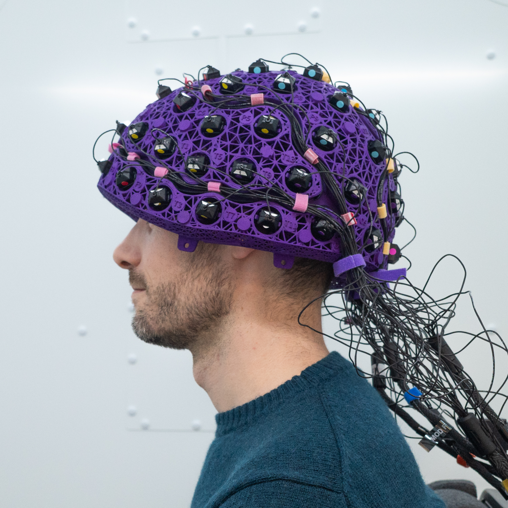

# OPM-MEG Tutorials in osl-ephys

### At Oxford we have a Cerca Magnetics Neuro-1 (QZFM) system made up of 64-sensors and 192 channels. The tutorials below cover various aspects of data processing during a movement task in the prescence of low-frequency artefacts.

## 1. [Preprocessing](01_OPM_preprocessing_forOSLcourse.md)
## 2. [Sensor-Level Analysis (Time-Frequency)](02_sensor_level_TFR.md)
## 3. [Coregistration](03_rhino_coreg.md)
## 4. [Source Localisation](04_source_recon.md)
