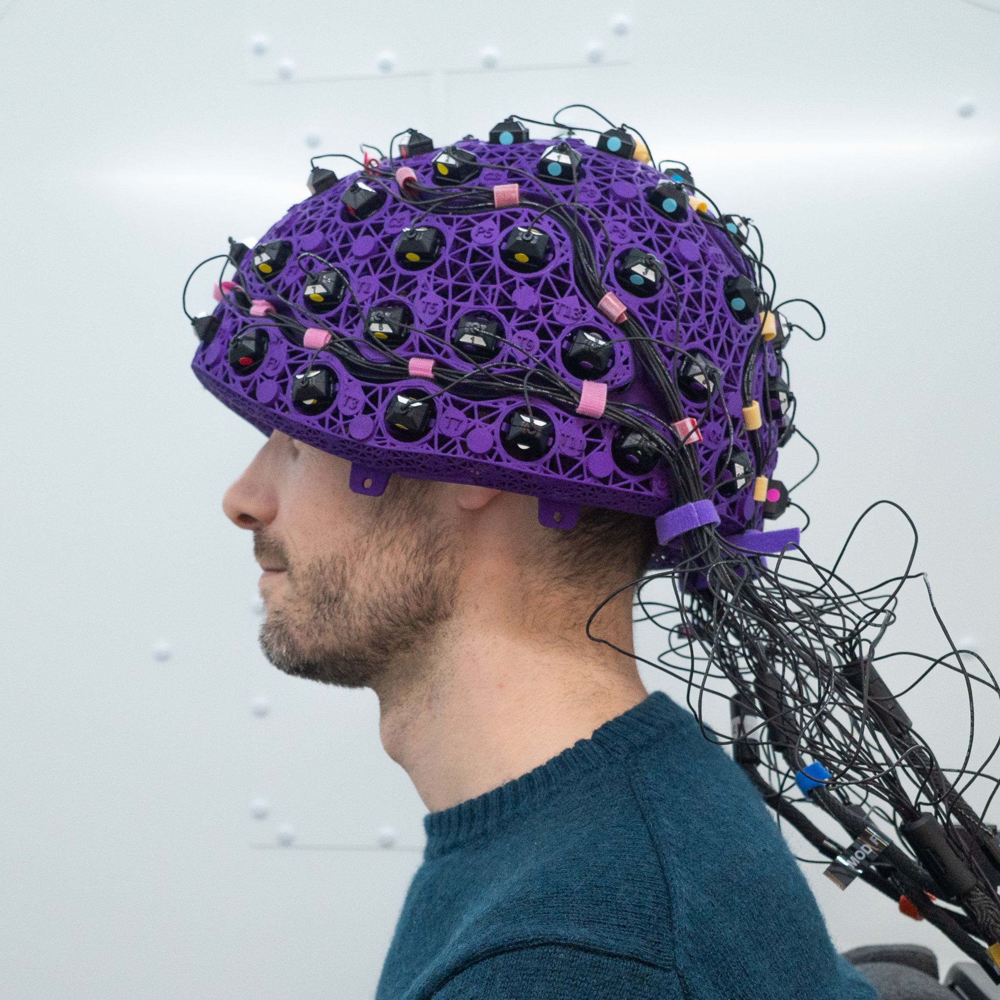

# OPM-MEG Tutorials in osl-ephys

### ⚙️ Software requirements

These tutorials rely on **homogeneous field correction**  
(Tierney et al., 2021), which is only available in:

- **`MNE` ≥ 0.18**
- **`osl-ephys` ≥ 0.24**

Please ensure your environment is up to date before continuing.



Please note, MNE currently cannot plot CERCA sensor layouts (pull-request required). Use [00_fix_3D_plotting.ipynb](00_fix_3D_plotting.ipynb) to fix.

## Download the sample data from osf
#### Also see [00_download_data.ipynb](00_download_data.ipynb)

```python
import os

basedir = os.getcwd()

def get_data(outdir, zip_name="study-FourMotorOPM.zip"):
    """Download and unzip the dataset from OSF project xh9b6."""
    if os.path.exists(os.path.join(outdir, zip_name.replace(".zip", ""))):
        print("Data already exists. Skipping download.")
        return

    os.system(f"osf -p xh9b6 fetch {zip_name}")
    os.system(f"unzip -o {zip_name} -d {outdir}")
    os.remove(zip_name)

    print(f"Data downloaded and extracted to: {outdir}")

get_data(basedir)
```

## 1. Preprocessing
- **[Notebook](./01_OPM_preprocessing.ipynb)**
- **[Markdown](./01_OPM_preprocessing.md)**
## 2. Sensor-Level Analysis (Time-Frequency)
- **[Notebook](./02_sensor_level_TFR.ipynb)**
- **[Markdown](./02_sensor_level_TFR.md)**
## 3. Coregistration
- **[Notebook](./03_rhino_coreg.ipynb)**
- **[Markdown](./03_rhino_coreg.md)**
## 4. Source Localisation
- **[Notebook](./04_OPM_beamforming.ipynb)**
- **[Markdown](./04_OPM_beamforming.md)**
## 5. Parcellation
#### This uses resting-state data
- **[Notebook](./05_OPM_parcellation.ipynb)**
- **[Markdown](./05_OPM_parcellation.md)**
